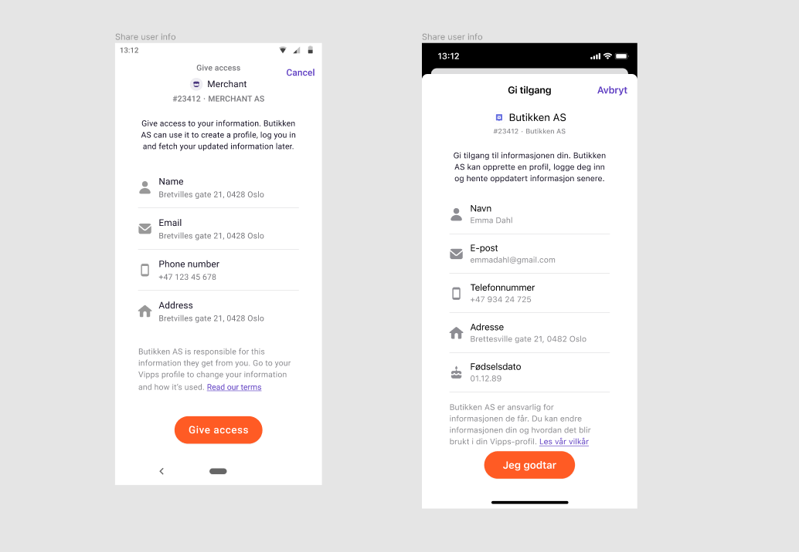
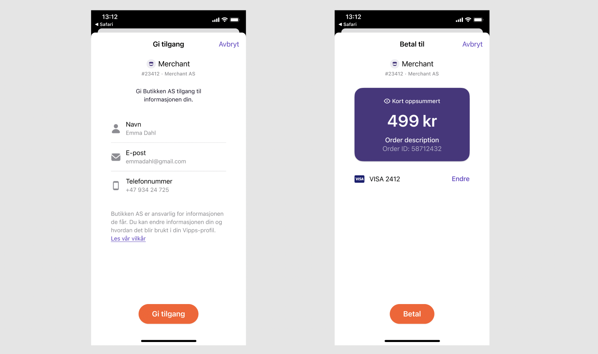
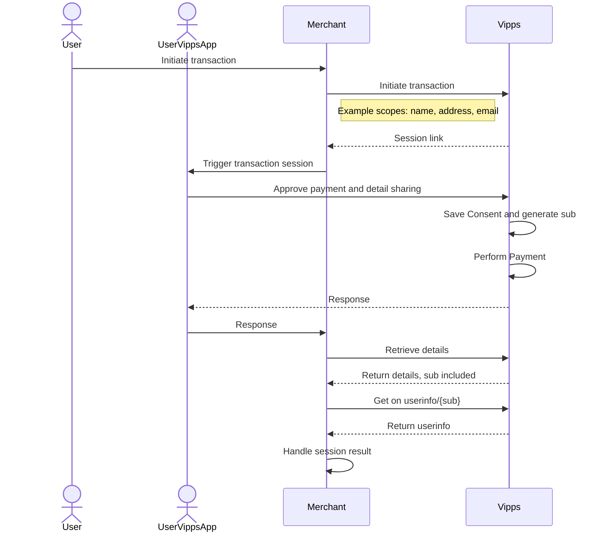

<!-- START_METADATA
---
title: API guide
sidebar_position: 1
pagination_next: null
pagination_prev: null
---
END_METADATA -->

# Userinfo API

The Vipps Userinfo API allows merchants to request the user's profile information as part of the payment flow.
The API follows the
[OIDC Standard](https://openid.net/specs/openid-connect-core-1_0.html#UserInfo).

To get access to user profile information, the merchant adds a `scope`
parameter and initiates specific API calls, as described [below](#userinfo-call-by-call-guide).

If the user has not already consented to sharing information from Vipps to the merchant,
they will be asked for any remaining consents before completing the payment flow.

In the Vipps app, they are presented with a consent card.
The following are examples of consent cards for Android (left) and iOS (right):



The consent card must be accepted before approving the payment or agreement in Vipps.

Once the flow is completed, the merchant can get the profile
information from the [Get Userinfo](https://vippsas.github.io/vipps-developer-docs/api/userinfo#operation/getUserinfo) endpoint.

A user's consent to share information with a merchant applies across all Vipps services. This is helpful, for example, if the merchant implements [Vipps Login](https://vippsas.github.io/vipps-developer-docs/docs/APIs/login-api) as part of the payment flow,
they can use Vipps to log the user in without the need for additional consents.


## Userinfo flow

The following is a illustration of a consent card and a payment screen.
The user must complete both screens before the merchant can gain access to their profile information.



Here follows a sequence diagram to illustrate the flow of steps.




## Userinfo call-by-call guide

Scenario: Complete a payment and get the name and phone number of
a customer.


1. Retrieve the access token with [`POST:/accesstoken/get`](https://vippsas.github.io/vipps-developer-docs/api/access-token#tag/Authorization-Service/operation/fetchAuthorizationTokenUsingPost).

    The access token is received on a successful request to the token endpoint described in the
[Access token API guide](https://vippsas.github.io/vipps-developer-docs/docs/APIs/access-token-api).


2. Determine the `scope` of your access request. This can include any of the following values, separated by a space:

    | Scope            | Description | User consent required |
    |:-----------------|:------------|:----------------------|
    | `address`        | A list containing the user's addresses. The list always contains the home address from the National Population Register and can also include work address and other addresses added by the user in Vipps. | yes |
    | `birthDate`      | Birth date. Verified with BankID. ISO 8601 format (2022-12-31) | yes |
    | `email`          | Email address. The flag `email_verified : true` (or `false`) in the response indicates whether the email address is verified. | yes |
    | `name`           | First, middle and given name. Verified with the National Population Register. | yes |
    | `phoneNumber`    | Phone number. Verified when creating the Vipps account. MSISDN format (4791234567).| yes |
    | `nin`            | Norwegian national identity number. Verified with BankID. **NB:** Merchants need to apply for access to NIN. See: [Who can get access to NIN and how?](/docs/APIs/login-api/vipps-login-api-faq.md#who-can-get-access-to-nin-and-how)    | yes |

    Example from the [Recurring API](https://vippsas.github.io/vipps-developer-docs/docs/APIs/recurring-api/vipps-recurring-api#userinfo-call-by-call-guide):

    ```json
    {
      "phoneNumber":"90000000",
      "interval": {
        "unit": "MONTH",
        "count": 1
      },
      "merchantRedirectUrl": "https://example.com/confirmation",
      "merchantAgreementUrl": "https://example.com/my-customer-agreement",
      "pricing": {
        "type": "LEGACY",
        "amount": 49900,
        "currency": "NOK"
      },
      "productDescription": "Access to all games of English top football",
      "productName": "Premier League subscription",
      "scope": "name phoneNumber"
    }
    ```


    **Please note:** If the e-mail address that is delivered has the flag `email_verified : false`,
    this address should not be used to link the user to an existing account without
    further authentication. Such authentication could be to prompt the user to
    log in to the original account or to confirm the account linking by providing a
    confirmation link sent to the email address.

3. Make the API call that initiates the Vipps payment or agreement. Include the `scope` in the body:

    * Recurring API: [`POST:/recurring/agreements`](https://vippsas.github.io/vipps-developer-docs/api/recurring#tag/Agreement-v3-endpoints/operation/DraftAgreementV3)
    * ePayment API: [`POST:/epayment/v1/payments`](https://vippsas.github.io/vipps-developer-docs/api/epayment#tag/CreatePayments)
    * eCom API: [`POST:/ecomm/v2/payments`](https://vippsas.github.io/vipps-developer-docs/api/ecom#tag/Vipps-eCom-API/operation/initiatePaymentV3UsingPOST)


4. The user consents to the information sharing and completes the payment in Vipps.


5. Retrieve the `sub` by calling the API endpoint that provides information about the payment or agreement.

   * Recurring API: [`GET:/recurring/agreements/{agreementId}`](https://vippsas.github.io/vipps-developer-docs/api/recurring#tag/Agreement-v3-endpoints/operation/FetchAgreementV3)
   * ePayment API: [`GET:/epayment/v1/payments/{reference}`](https://vippsas.github.io/vipps-developer-docs/api/epayment#tag/QueryPayments/operation/getPayment)
   * eCom API: [`GET:/ecomm/v2/payments/{orderId}/details`](https://vippsas.github.io/vipps-developer-docs/api/ecom#tag/Vipps-eCom-API/operation/integrationTestApprovePayment)


   The `sub` identifies the user. It is a link between the merchant and the user and can be used to retrieve the user's details from Vipps userinfo.

    The `sub` is based on the user's national identity number ("fødselsnummer"
    in Norway), and does not change (except in very special cases). The format is:

    ```json
    "sub": "c06c4afe-d9e1-4c5d-939a-177d752a0944",
    ```

6. To retrieve the user's information, call
    [`GET:/vipps-userinfo-api/userinfo/{sub}`](https://vippsas.github.io/vipps-developer-docs/api/userinfo#operation/getUserinfo)
    with the `sub` that was retrieved earlier.

    This endpoint returns the payload with the information that the user has consented to share.
    See below on how to construct the call.


   

    **Please note:** It is recommended to get the user's information directly after
    completing the transaction. There is a *time limit of 168 hours*
    (one week) to retrieve the consented profile data from the
    [`/userinfo`](https://vippsas.github.io/vipps-developer-docs/api/userinfo) endpoint.
    
    This is to
    better support merchants that depend on manual steps/checks in their process of
    fetching the profile data. The merchant will get the information that is in the
    user profile at the time when they actually fetch the information. This means
    that the information might have changed from the time the user completed the
    transaction and the fetching of the profile data.

    **Please note:** The `sub` is added asynchronously, so if the API call in (5) above
    is made within (milli)seconds of the payment approval in the app, it may not be
    available. If that happens, simply make another request.
    See
    [Polling guidelines](https://vippsas.github.io/vipps-developer-docs/docs/vipps-developers/common-topics/polling-guidelines)
    for more recommendations.


## Userinfo call

### Request

#### Headers

| Header        | Description             |
|:--------------|:------------------------|
| Authorization | "Bearer {Access Token}" |

The access token is received on a successful request to the token endpoint described in the
[Access token API guide](https://vippsas.github.io/vipps-developer-docs/docs/APIs/access-token-api).

**Example response from a successful call:**

```json
{
  "sub": "c06c4afe-d9e1-4c5d-939a-177d752a0944",
  "birthdate": "1815-12-10",
  "email": "user@example.com",
  "email_verified": true,
  "nin": "10121550047",
  "name": "Ada Lovelace",
  "given_name": "Ada",
  "family_name": "Lovelace",
  "sid": "f26d25af56909b55",
  "phone_number": "4791234567",
  "address": {
    "street_address": "Suburbia 23",
    "postal_code": "2101",
    "region": "OSLO",
    "country": "NO",
    "formatted": "Suburbia 23\\n2101 OSLO\\nNO",
    "address_type": "home"
  },
  "other_addresses": [
    {
      "street_address": "Fancy Office Street 2",
      "postal_code": "0218",
      "region": "OSLO",
      "country": "NO",
      "formatted": "Fancy Office Street 2\\n0218 OSLO\\nNO",
      "address_type": "work"
    },
    {
      "street_address": "Summer House Lane 14",
      "postal_code": "1452",
      "region": "OSLO",
      "country": "NO",
      "formatted": "Summer House Lane 14\\n1452 OSLO\\nNO",
      "address_type": "other"
    }
  ],
  "accounts": [
    {
      "account_name": "My savings",
      "account_number": "12064590675",
      "bank_name": "My bank"
    }
  ]
}
```
